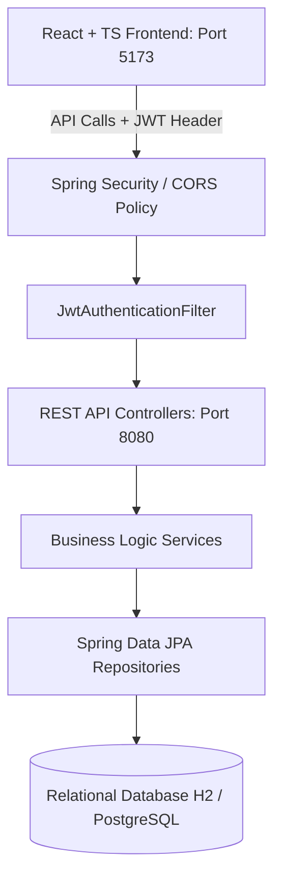

# INTERNSHIP PROJECT REPORT

**PROJECT TITLE:** College Management Information System (CMIS)  
**SUBMITTED BY:** Mohammed Raheesh  
**ORGANIZATION:** Edigoble (In association with Hexaware)  
**ROLE:** Internship Trainee  
**ACADEMIC TERM:** Spring 2026  

---

## 1. Project Cover Information

*   **Developer:** Mohammed Raheesh
*   **Internship Provider:** Edigoble
*   **Collaborating Partner:** Hexaware Technologies
*   **Role:** Full-Stack Development Intern
*   **Project Managed At:** `c:\Users\mohammed raheesh\OneDrive\Desktop\intern_major`
*   **GitHub Repository:** [Mohammedraheesh/college-management-system-cmis](https://github.com/Mohammedraheesh/college-management-system-cmis)

---

## 2. Project Executive Summary

The **College Management Information System (CMIS)** is a secure, modern, multi-tier enterprise web application developed during the internship term. The application serves two core users:
1.  **Administrative Staff (`ROLE_ADMIN`)**: Equipped with full CRUD capabilities to manage students, courses, grades, and tuition billing statements.
2.  **Students (`ROLE_STUDENT`)**: Provided with secure, read-only dashboard access to monitor their academic GPA, view registered courses, check exam report cards, and track outstanding balance dues.

---

## 3. Visual Interface Mockups

### 3.1. User Authentication Portal
The login system is built using a custom glassmorphism dark-theme layout with violet and pink neon glowing border accents. It manages session security via stateless JWT authorization headers.

*(Visual previews are available inside the artifact report in your chat dashboard).*

### 3.2. Main Academic Dashboard
For students, the home page estimates overall GPA and compiles transaction balances. For admins, the dashboard displays active enrollment counts and pending tuition fees.

### 3.3. Interactive Course Catalogue
Allows the institution to declare course offerings, syllabus descriptions, departments, and credit hours in a fluid card layout.

---

## 4. System Architecture

The application implements a decoupled, modern architecture:



### 4.1. Technical Stack Details
*   **Backend REST Engine**: Spring Boot 3.2.x, Java 17, Spring Security, Spring Data JPA, Hibernate.
*   **Security Framework**: Spring Security, JWT (JJWT 0.12.x), BCrypt Password Encoder.
*   **Frontend SPA Client**: React 18, Vite, TypeScript, Axios (with automatic 401 logout interceptor hook), React Hook Form, Yup validation.
*   **Database Systems**: H2 In-Memory Database (for development/testing) and PostgreSQL (for production containerization).
*   **CI/CD Pipeline**: GitHub Actions for automated building, JUnit 5 testing, and Docker compilation.

---

## 5. Key Implementation Features

### 5.1. Database Seeding & Setup
To ensure immediate usability, a `DataInitializer` class is bundled. Upon boot, it seeds H2 with:
*   An administrator account (`admin@college.com` / `admin123`).
*   Three student user profiles (`alice.student@college.edu`, `bob.student@college.edu`, `charlie.student@college.edu`).
*   Course syllabus entries, academic transcripts, and outstanding invoice cards.

### 5.2. Automatic Balance & Grade Summing
JPA Entity lifecycle hooks (`@PrePersist` and `@PreUpdate`) calculate metrics automatically at the database level:
*   `Mark` Entity: `total = internalMarks + endExamMarks`.
*   `Fee` Entity: `balanceDue = totalFee - amountPaid`.

### 5.3. Graceful Token Expiry
The frontend handles JWT lifetimes proactively:
*   The `AuthContext` decodes the token's expiration claim and schedules a matching client-side timer.
*   Upon timer completion, it automatically triggers a logout sequence, clears the local storage cache, redirects the user to `/login`, and flashes a toast alert.

---

## 6. How to Run the Application Locally

1.  Clone the repository from GitHub.
2.  Open **PowerShell** in the project directory.
3.  Execute the custom startup script to launch both servers in independent windows:
    ```powershell
    Set-ExecutionPolicy -Scope Process -ExecutionPolicy Bypass; .\run-app.ps1
    ```
4.  Navigate to **[http://localhost:5173](http://localhost:5173)** to access the live dashboard.
